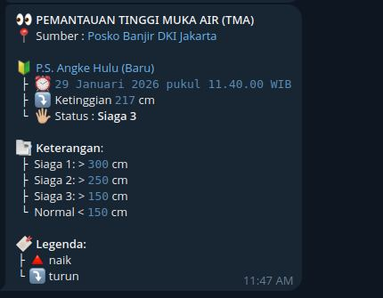

# Monitor Air

Script ini mengambil data dari Posko Banjir DKI Jakarta, memantau pintu air **P.S. Angke Hulu (Baru)** (ID 158), dan mengirim notifikasi Telegram hanya jika **STATUS_SIAGA berubah**.



## Struktur
- `src/monitor.ts`: entrypoint utama
- `src/lib.ts`: helper untuk parsing dan format pesan
- `src/monitor.test.ts`: test

## Prasyarat
- Bun terpasang
- Bot Telegram + Chat ID

## Konfigurasi
Buat file `.env` di folder ini:

```
TELEGRAM_BOT_TOKEN=123456:ABCDEF...
TELEGRAM_CHAT_ID=123456789
PINTU_AIR_ID=158
DRY_RUN=1
FORCE_SEND=1
```

`PINTU_AIR_ID` opsional. Default `158` (P.S. Angke Hulu).  
`DRY_RUN` opsional. Jika diaktifkan, script **tidak** mengirim ke Telegram dan hanya menulis pesan ke stdout (state tetap diperbarui).  
`FORCE_SEND` opsional. Jika diaktifkan, pesan akan dikirim **meskipun** status tidak berubah (tetap menghormati `DRY_RUN`).

## Output tambahan
Setiap kali jalan, script akan:
- Menulis daftar pintu air ke `pintu_air.json`.
- Menampilkan output lengkap di stdout (pesan + data mentah).

## Menjalankan manual
```
bun run src/monitor.ts
```

Atau pakai scripts:
```
bun run start
bun run dev
bun run test
bun run lint
```

## Menjalankan via Docker (GHCR)
1) Siapkan file `.env` seperti di atas.
2) Buat folder `data` untuk file state:
```
mkdir -p data
touch data/state.json data/pintu_air.json
```
3) Jalankan dengan Docker:
```
docker run --rm \\
  --env-file .env \\
  -e CRON_EVERY_MINUTES=5 \\
  -v $(pwd)/data/state.json:/app/state.json \\
  -v $(pwd)/data/pintu_air.json:/app/pintu_air.json \\
  ghcr.io/banghasan/monitor-air-telegram:latest
```
Image ini menjalankan cron di dalam container.

Atau pakai docker-compose:
```
docker compose -f docker-compose.ghcr.yml up
```

Override env saat run (nilai `environment` lebih tinggi dari `env_file`):
```
TELEGRAM_CHAT_ID=123456789 DRY_RUN=1 docker compose -f docker-compose.ghcr.yml up
```

Jadwal cron di dalam container:
- `CRON_EVERY_MINUTES` untuk interval menit (default `5`)
- `CRON_SCHEDULE` untuk ekspresi cron penuh (menimpa `CRON_EVERY_MINUTES`)

Contoh:
```
# setiap 5 menit
CRON_EVERY_MINUTES=5 docker compose -f docker-compose.ghcr.yml up

# jam 07:00 setiap hari
CRON_SCHEDULE="0 7 * * *" docker compose -f docker-compose.ghcr.yml up
```

Catatan:
- Pertama kali dijalankan, script hanya menyimpan status awal ke `state.json` dan **tidak** mengirim notifikasi.
- Notifikasi hanya dikirim jika `STATUS_SIAGA` berubah pada run berikutnya.

## Lint & Test
- Lint: `bun run lint`
- Auto-fix: `bun run lint:fix`
- Test: `bun run test`

## Cronjob tiap 5 menit
1) Cek lokasi bun:
```
which bun
```

2) Tambahkan ke crontab (`crontab -e`):
```
*/5 * * * * /path/to/bun /home/DATA/bun/cekAir/src/monitor.ts >> /home/DATA/bun/cekAir/monitor.log 2>&1
```

Ganti `/path/to/bun` sesuai output `which bun`.

## Format pesan
Pesan Telegram akan tampil seperti:
- Judul bold
- Link sumber Posko Banjir DKI Jakarta
- Link lokasi Google Maps berdasarkan `LATITUDE` dan `LONGITUDE`
- Tanggal dalam format WIB
- Icon naik/turun berdasarkan `TINGGI_AIR` dibanding `TINGGI_AIR_SEBELUMNYA`
